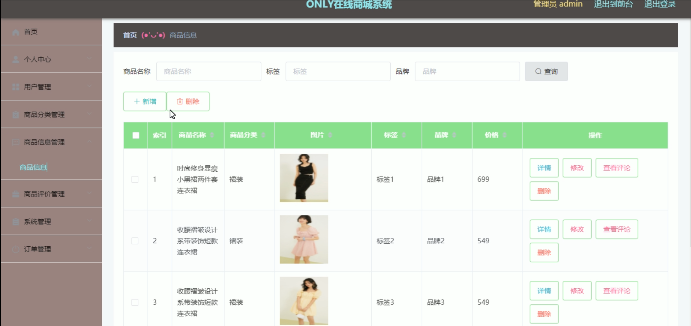

# 基于springboot的ONLY在线商城系统

---
### 👉作者QQ ：1556708905 微信：zheng0123Long (支持定制修改、部署调试、定制毕设)

### 👉接网站建设、小程序、H5、APP、各种系统等

---

#### 介绍

基于Springboot的ONLY在线商城系统是一款专为在线购物设计的高效管理平台，旨在提升购物和管理的便捷性和用户体验。该系统分为管理员角色和用户角色，每个角色均提供了丰富的功能模块，以满足不同用户的需求和职责。

#### 技术栈

后端技术栈：Springboot+Mysql+Maven

前端技术栈：Vue+Html+Css+Javascript+ElementUI

开发工具：Idea+Vscode+Navicate

#### 系统功能介绍

管理员角色功能模块

个人中心：管理员可以在个人中心查看和编辑个人信息，包括修改密码和更新联系方式。

用户管理：管理员可以管理用户信息，包括新增、修改和删除用户，确保用户数据的准确性和及时更新。

商品分类管理：管理员可以管理商品分类，增加、修改和删除商品分类，确保商品分类结构的合理性。

商品信息管理：管理员可以管理商品信息，包括新增、修改和删除商品，确保商品信息的完整和准确。

商品评价管理：管理员可以查看和管理用户对商品的评价，及时处理不当评价，提升商品服务质量。

系统管理：包括系统设置、权限管理等，确保系统的稳定运行和安全性。

订单管理：管理员可以查看和管理所有订单信息，包括订单的审核、发货和退货等操作，确保订单处理的高效和准确。

用户角色功能模块

商品信息：用户可以浏览和查看商城中的商品信息，包括商品详情、价格、库存等。

商品资讯：用户可以查看商城发布的商品资讯，获取最新的商品动态和促销信息。

个人中心：用户可以在个人中心查看和编辑个人信息，包括修改密码和更新联系方式。

后台管理：

商品评价管理：用户可以查看和管理自己对商品的评价，修改或删除已发布的评价。

我的收藏管理：用户可以查看和管理自己收藏的商品，方便快速找到心仪商品。

订单管理：用户可以查看和管理自己的订单，包括订单的支付、查看物流信息和申请退换货等操作。

购物车：用户可以将心仪的商品添加到购物车中，方便统一结算和购买。

客服：用户可以通过客服功能与商城客服人员进行沟通，解决购物过程中的问题和疑问。

#### 系统作用

对管理员的作用

高效管理：系统提供了丰富的管理工具，帮助管理员高效地管理用户和商品信息，确保商城运营的高效和顺畅。

信息传达：通过商品评价管理和商品资讯模块，管理员可以及时了解用户反馈和发布重要信息。

订单处理：订单管理模块帮助管理员高效处理订单，确保订单处理的及时性和准确性。

对用户的作用

便捷购物：用户可以方便地浏览和购买商品，享受便捷的在线购物体验。

信息获取：通过商品资讯模块，用户可以及时获取最新的商品动态和促销信息。

订单管理：用户可以方便地管理自己的订单，查看订单状态和进行售后处理，提升购物体验。

#### 系统功能截图

代码结构

数据库表

登录

用户管理

商品分类管理

商品信息管理

系统管理

前台页面首页

购物车

客服

用户端后台管理

#### 总结

基于Springboot的ONLY在线商城系统通过角色分工和功能模块的设计，实现了在线购物平台的高效管理和便捷使用。管理员可以通过系统高效地管理用户和商品信息，确保商城运营的顺畅；用户则可以享受便捷的在线购物体验，提升购物满意度。该系统不仅提高了商城管理的效率和安全性，也为用户提供了优质的购物服务。

#### 使用说明

创建数据库，执行数据库脚本 修改jdbc数据库连接参数 下载安装maven依赖jar 启动idea中的springboot项目

 后台管理：http://localhost:8080/ONLYzaixianshangcheng/admin/dist/index.html#/login 

	前台：http://localhost:8080/ONLYzaixianshangcheng/front/index.html 

管理员  admin  密码：admin     

